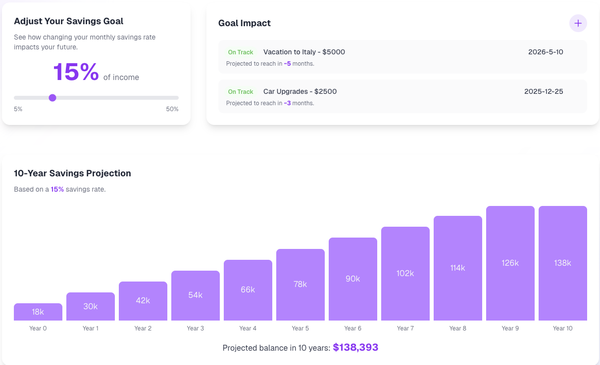

# Beyond the Black Box: Deconstructing Financial Health with WealthScore

## The Inspiration: A Score That Doesn't Tell the Whole Story
For years, we, like many others, were conditioned to view our financial health through a single, opaque lens: the credit score. It’s a number shrouded in mystery, controlled by algorithms we don’t understand, that dictates some of the most important decisions of our lives. But we always felt a deep disconnect. We could have a "good" credit score while simultaneously feeling stressed about our month-to-month cash flow, our lack of savings, or our spending habits. The credit score told lenders we were a good risk, but it never told us if we were truly healthy.

This frustration was the seed for WealthScore. What if we could create a score that was intuitive, transparent, and actually reflected our day-to-day financial well-being? A score that felt less like a judgment and more like a helpful guide.

## What We Learned: Defining "Financial Wellness"
Before writing a single line of code, we dove into research. The question wasn't "How do we build an app?" but "What does it actually mean to be financially healthy?"

We were heavily inspired by the framework developed by the Consumer Financial Protection Bureau (CFPB). Their extensive research defines financial well-being as a state where a person can meet their financial obligations, feel secure in their financial future, and make choices that allow them to enjoy life. They identified four core components:

1. Control over day-to-day, month-to-month finances.
2. Capacity to absorb a financial shock.
3. Being on track to meet financial goals.
4. Financial freedom to make the choices that allow one to enjoy life.

## How We Built It: The Five Pillars of WealthScore
We formulated our own score by creating five pillars, each designed to measure a specific aspect of financial health we research earlier. Each pillar is scored from 0 to 100 and contributes to the final WealthScore.

1. **Spending Balance Score**:
This directly measures your control over your finances. It’s not about how much you earn, but how well you manage what you have. We reward disciplined spending relative to a user-defined budget for non-essential, discretionary items, helping you see where your money is going.

2. **Savings Ratio Score**:
This pillar addresses the goal of being on track to meet financial goals. A consistent savings habit is the single most powerful predictor of future financial security. Our score compares your savings rate to established financial guidelines, encouraging healthy habits that build wealth over time.

3. **Bill Timeliness Score**:
Another direct measure of control over finances. Paying bills on time is a foundational financial habit that avoids late fees and unnecessary stress. This is the most straightforward of our calculations, reflecting a simple but crucial behavior.

4. **Emergency Cushion/ Liquidity Score**:
This is our measure for your capacity to absorb a financial shock. Research consistently shows that a lack of liquid savings—an emergency fund—is a primary source of financial fragility. This score measures the buffer you have between your available cash and your upcoming financial obligations.

5. **Debt / Risk Score**:
High-interest debt can cripple financial progress. This pillar reflects the risk associated with a high debt load relative to your income. While not a direct measure from the CFPB framework, it's a critical factor in achieving financial freedom.

The Final WealthScore is a weighted average:
$$W_{\text{score}} = (S_{\text{spending}} \cdot 0.25) + (S_{\text{savings}} \cdot 0.20) + (S_{\text{bills}} \cdot 0.20) + (S_{\text{liquidity}} \cdot 0.15) + (S_{\text{debt}} \cdot 0.20)$$

To bring these five pillars to life, we chose to build a dynamic web application using React.js, Next.js, and Node.js. This framework allowed us to create a highly interactive and responsive user interface, which was crucial for our goal of making financial data feel intuitive and simple. We focused heavily on data visualization, incorporating a prominent central score gauge, clear progress bars for goals, and a detailed transactions table with sorting and filtering. Additionaly, we leveraged AI, implementing a WeathScore AI ChatBot that uncovers information, provides recomendations, and helps you on your financial journey. By presenting complex information through accessible graphics, organized tables, and AI, we ensured that users could grasp their financial standing at a glance and dive into the details effortlessly.

## The Challenges We Faced
Our primary challenge was navigating the inherent complexity of financial data, especially when it came to interacting with a new and powerful tool like the Nessie API. This proved to be a significant learning curve for our team. We spent a considerable amount of time deciphering the specific requirements for API requests, from structuring the payloads correctly to authenticating our calls. We encountered frustrating 400 Bad Request errors that sent us back to the documentation to debug subtle issues in the data we were sending. It was a process of trial and error, but through it, we gained a deep appreciation for the precision required to work with financial APIs. Overcoming this technical hurdle was a major breakthrough, as good, representative data is foundational for our project.

## The Journey Forward
This project was a profound learning experience. It taught us that the most powerful tools are often the ones that bring clarity to complexity. Building WealthScore wasn't just about coding; it was about deconstructing a complex human experience—financial stress—and translating it into something understandable, actionable, and ultimately, hopeful.
